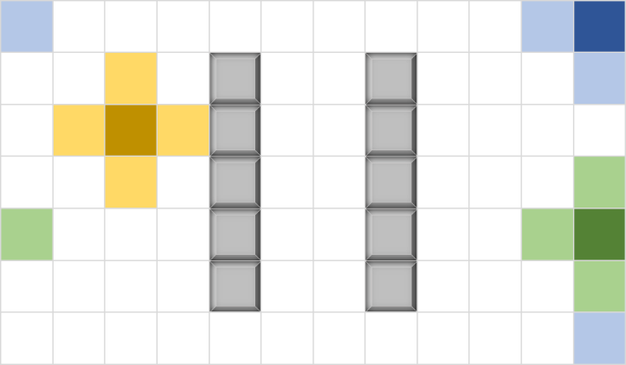
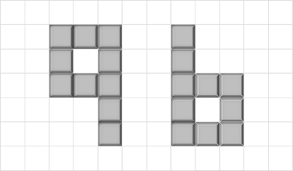
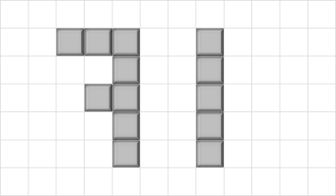
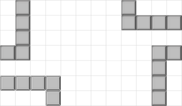
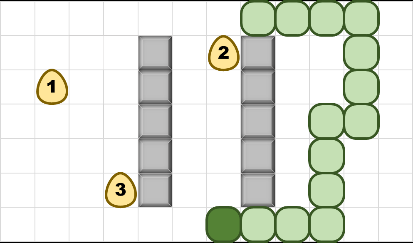
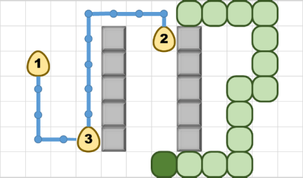

# Snake

Una serie di ostacoli sono stati disposti su un mondo bidimensionale di 𝑁×𝐾 quadrati. 
Questo mondo è circolare quindi il quadrato adiacente a destra di una posizione sull'estrema destra è quello corrispondente nella stessa riga 
ma all'estrema sinistra, e allo stesso modo con qualsiasi bordo del terreno. 
L'immagine seguente mostra un mondo valido e alcuni quadrati con quelli adiacenti evidenziati.



Tutte le piazze “libere” del mondo devono essere raggiungibili l’una dall’altra. 
L'immagine seguente mostra un mondo non valido e due validi. 
Nota che il mondo a destra può raggiungere i quadrati “quarto” a causa della proprietà circolare del mondo.

      

In questo mondo vive un serpente goloso a cui piacciono le uova.
Il serpente occupa una sequenza di quadrati adiacenti in cui nessun quadrato si ripete.
La prima casella rappresenta la “testa” del serpente e l'ultima la coda.

 


## DESCRIZIONE
Il serpente inizia con una lunghezza di due quadrati. 
Il serpente si muove facendo avanzare la testa verso una casella adiacente (diversa dalla casella successiva del suo corpo) 
e spostando l'intero corpo verso la casella adiacente corrispondente in modo tale da mantenere l'integrità fisica. 
Inizialmente ci sono 𝑄 uova depositate sul terreno. Il serpente “mangia” un uovo spostandosi verso la piazza in cui si trova. 
Il serpente si muove sempre in una certa direzione a meno che non gli venga comandato di cambiare direzione. 
Non avrà alcun effetto comandargli di cambiare direzione nella direzione opposta a quella verso cui è rivolto.

# Regole
* Le uova sono numerate con valori da 1 a 𝑄.
* Ogni volta che il serpente mangia un uovo, cresce quel numero di cellule. 
Il valore dell'uovo più vicino viene moltiplicato per 100 per aumentare il punteggio totale del gioco. 
Nota che l'ultimo uovo contribuisce solo alla crescita del serpente.
* Il concetto di prossimità tra il serpente e un uovo è dato dalla più piccola sequenza di scatole non “di ostacolo” 
che separano la testa del serpente dall'uovo. Se due uova fossero alla stessa distanza, 
per il punteggio verrà considerato il valore di quella più grande. Da notare che il corpo del serpente 
non viene considerato un “ostacolo” sul percorso.
            
          ```In questa immagine, se il serpente mangiasse l’uovo “3” otterrebbe solo 100 punti, poiché l’uovo “2” è più lontano.```
    
* Ogni volta che tutte le uova vengono rimosse dal terreno, altre 𝑄 uova appaiono negli spazi non occupati del terreno.
* Il serpente non può “mangiare” se stesso o un ostacolo. Se ciò accade, il livello termina con il punteggio ottenuto.
* Se non si trovano più uova, il livello termina.